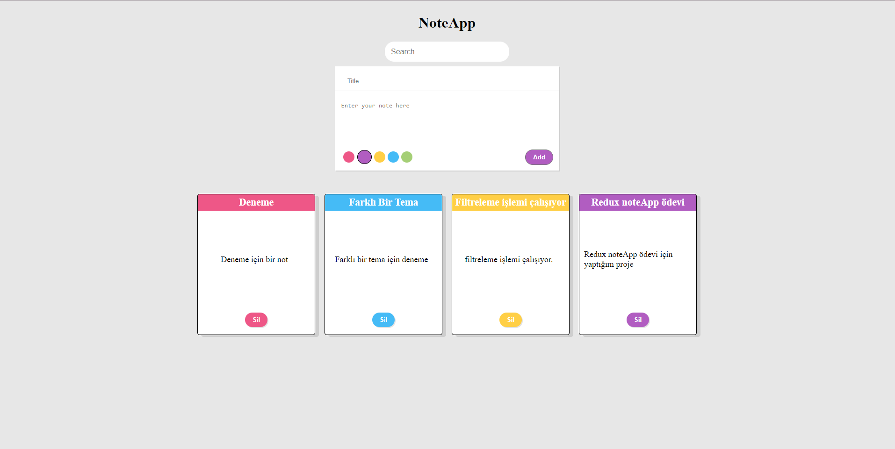

# react-redux-note-app
[Patika Dev](www.patika.dev)'in 6 aylık full stack dev bootcampi kapsamında yaptığım react-redux-note-app projesi

Projenin demosuna [buradan]() ulaşabilirsiniz !

### Gereksinimler
- Textarea'a ya yazılacak olan notlar kayıt edilip listelenmelidir.
- Yeni bir not eklerken renk seçimi yapılabilmelidir.
- Notları kayıt etmeden önce seçilen renk ne ise o renkte listelenmelidir.
- Ekrandaki bir diğer input ile daha önce yazılmış herhangi not filtrelenebilmelidir.

#### Proje Ekran Görüntüsü
